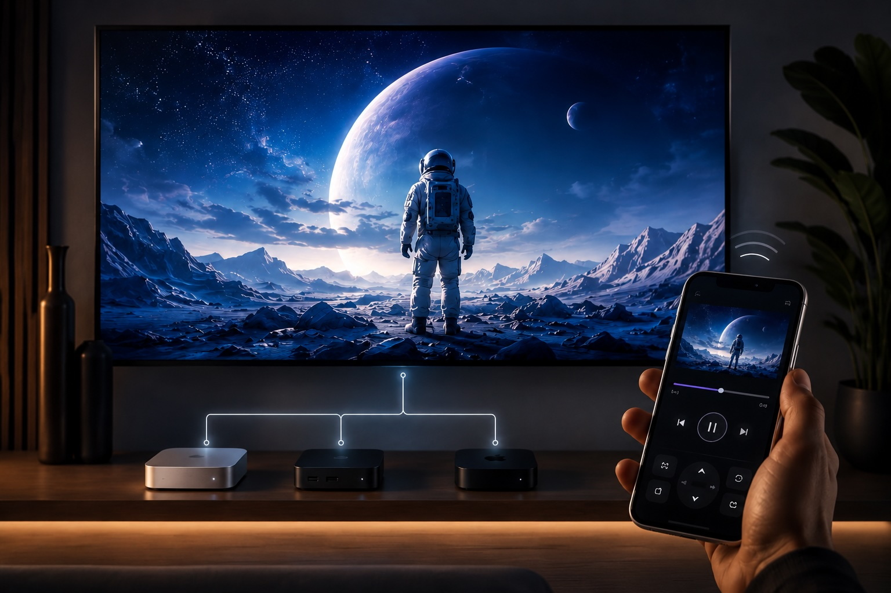
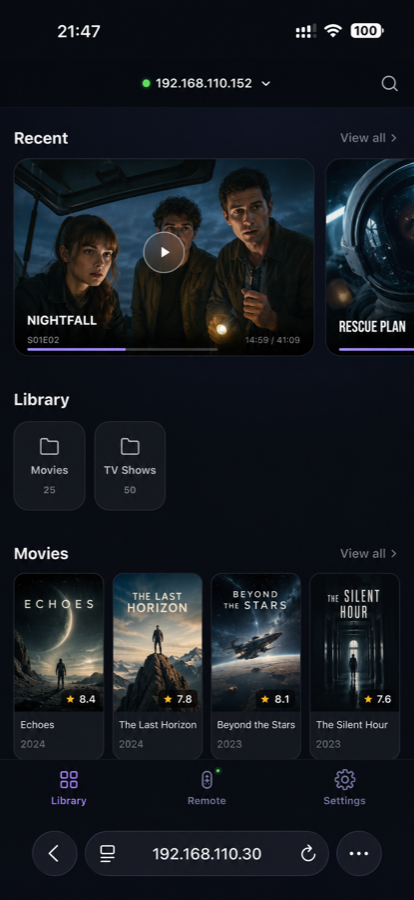
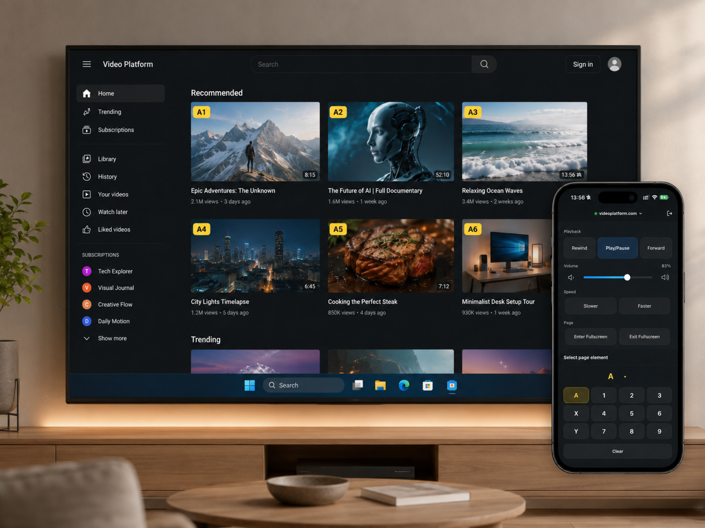

# TinyPlay

> Turn an idle Windows mini PC, laptop, or Mac mini into a lightweight living-room media player — controlled from your phone.

[中文说明](README.zh-CN.md) · **[View the TinyPlay website](https://yanghanqing.github.io/tinyplay/)**

TinyPlay is a lightweight living-room media player for idle Windows mini PCs, laptops,
and Mac minis. Connect one to your television and it becomes an mpv-powered playback
device, with your phone serving as the remote control.

These machines vastly outperform set-top boxes, yet a keyboard and mouse feel awkward
in front of a TV and a traditional remote is no good at typing searches or scrubbing
through a timeline.

TinyPlay lets each device do what it does best: **let hardware handle playback, let the
phone handle interaction.**

  

## Features

- **Phone browser remote** — scan the QR code and you're ready; no app to install
- **Web browser** — browse common streaming sites such as YouTube and Netflix on the TV without reaching for a keyboard or mouse
- **Media servers** — connect to Emby, Jellyfin, or Plex for poster walls, episode browsing, search, and resume playback
- **File browsing** — navigate SMB, WebDAV shares, or local directories and play files directly
- **Live TV** — integrate IPTV channel lists with favorites and recent-view history
- **DLNA casting** — cast streams from compatible apps on your local network; the phone remote remains available for playback control
- **Multi-server** — mount multiple media sources simultaneously and switch between them at will
- **Cross-platform** — available for Windows and macOS, including Apple Silicon and Intel; a separate [Apple TV edition](https://apps.apple.com/app/tinyplay-video-remote/id6788041703) is available too
- **mpv under the hood** — MKV, HDR, Dolby Vision, TrueHD, PGS subtitles and more

## See it in action

  
  

## Download

Download the latest build from [GitHub Releases](../../releases/latest).

- **Windows x86-64** — run `TinyPlay-Setup-x64.exe`. It creates Start-menu and
  desktop shortcuts, then starts TinyPlay when installation finishes. Future
  installers recognise the existing installation, close TinyPlay, and upgrade
  it in place while keeping your settings. Windows may show a SmartScreen
  warning because the current build is unsigned.
- **macOS** — Apple Silicon (`TinyPlay-macos-arm64.dmg`) and Intel
  (`TinyPlay-macos-intel.dmg`) are both available. Open the DMG and drag
  TinyPlay to Applications.

The phone and the computer running TinyPlay must be on the same local network.

## Getting Started

For screenshots, feature walkthroughs, and the living-room player buying guide,
visit the **[TinyPlay introduction page](https://yanghanqing.github.io/tinyplay/)**.

## TinyPlay and Kodi

Kodi suits people who want to turn a TV into a deeply customisable media centre. TinyPlay
suits people who want less setup, a phone remote, and a quick way to play video.

**TinyPlay is likely a better fit if you:**

- 💡 Want to get set up quickly, without a long configuration session
- 📱 Prefer controlling playback from your phone and do not want another app to install
- 🎬 Mainly want to play video rather than maintain a complex media-library taxonomy
- 🔧 Value a lightweight, ready-to-use setup

In short: **Kodi = an all-purpose media centre; TinyPlay = a lightweight computer TV box
with a phone remote.**

## License

TinyPlay is released under the [GNU General Public License v3.0](LICENSE).
Bundled third-party components are distributed under their own licenses; see
[THIRD_PARTY_NOTICES.md](THIRD_PARTY_NOTICES.md).
